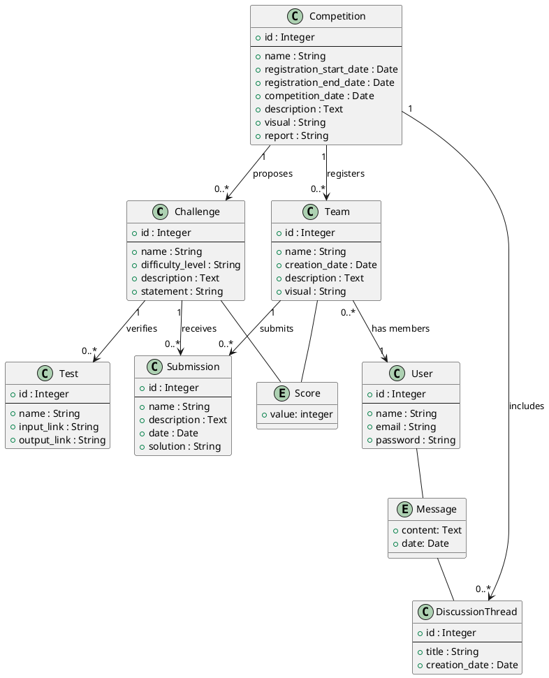
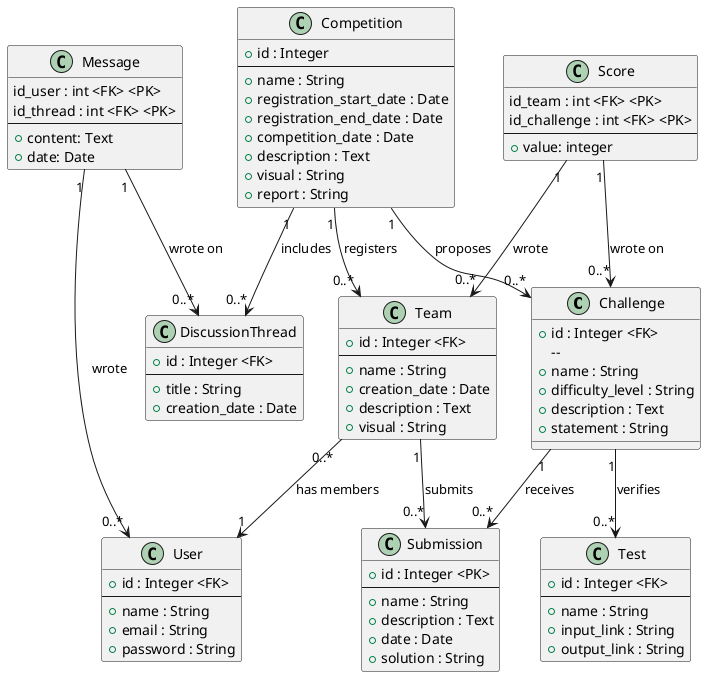

# MCD

```plantuml
hide empty members

scale 1000 width
scale 700 height

@startuml
class "Challenge" {
+ id : Integer
--
+ name : String
+ difficulty_level : String
+ description : Text
+ statement : String
}

class Competition {
+ id : Integer
--
+ name : String
+ registration_start_date : Date
+ registration_end_date : Date
+ competition_date : Date
+ description : Text
+ visual : String
+ report : String
}

class DiscussionThread {
+ id : Integer
--
+ title : String
+ creation_date : Date
}

class User {
+ id : Integer
--
+ name : String
+ email : String
+ password : String
}

class Team {
+ id : Integer
--
+ name : String
+ creation_date : Date
+ description : Text
+ visual : String
}

class Test {
+ id : Integer
--
+ name : String
+ input_link : String
+ output_link : String
}

class Submission {
+ id : Integer
--
+ name : String
+ description : Text
+ date : Date
+ solution : String
}

Entity Score{
    + value: integer
}

Entity Message{ 
    + content: Text
    + date: Date
}

Competition "1" --> "0..*" Challenge : "proposes"
Competition "1" --> "0..*" DiscussionThread : "includes"
Competition "1" --> "0..*" Team : "registers"
Challenge "1" --> "0..*" Test : "verifies"
Challenge "1" --> "0..*" Submission : "receives"
Team "1" --> "0..*" Submission : "submits"
Team "0..*" --> "1" User : "has members"
Team  -- Score
Challenge  -- Score
User -- Message
Message -- DiscussionThread
@enduml
```

# MLD

```plantuml
hide empty members

scale 1000 width
scale 700 height

@startuml
class "Challenge" {
+ id : Integer <FK>
 --
+ name : String
+ difficulty_level : String
+ description : Text
+ statement : String
  }

class Competition {
+ id : Integer
--
+ name : String
+ registration_start_date : Date
+ registration_end_date : Date
+ competition_date : Date
+ description : Text
+ visual : String
+ report : String
  }

class DiscussionThread {
+ id : Integer <FK>
--
+ title : String
+ creation_date : Date
  }

class User {
+ id : Integer <FK>
--
+ name : String
+ email : String
+ password : String
  }

class Team {
+ id : Integer <FK>
--
+ name : String
+ creation_date : Date
+ description : Text
+ visual : String
  }

class Test {
+ id : Integer <FK>
--
+ name : String
+ input_link : String
+ output_link : String
  }

class Submission {
+ id : Integer <PK>
--
+ name : String
+ description : Text
+ date : Date
+ solution : String
  }

class Score{
id_team : int <FK> <PK>
id_challenge : int <FK> <PK>
--
+ value: integer 
}

class Message{
id_user : int <FK> <PK>
id_thread : int <FK> <PK>
--
+ content: Text
+ date: Date
}

Competition "1" --> "0..*" Challenge : "proposes"
Competition "1" --> "0..*" DiscussionThread : "includes"
Competition "1" --> "0..*" Team : "registers"
Challenge "1" --> "0..*" Test : "verifies"
Challenge "1" --> "0..*" Submission : "receives"
Team "1" --> "0..*" Submission : "submits"
Team "0..*" --> "1" User : "has members"
Score "1" --> "0..*" Challenge : "wrote on"
Score "1" --> "0..*" Team : "wrote"
Message "1" --> "0..*" DiscussionThread : "wrote on"
Message "1" --> "0..*" User : "wrote"
@enduml
```

